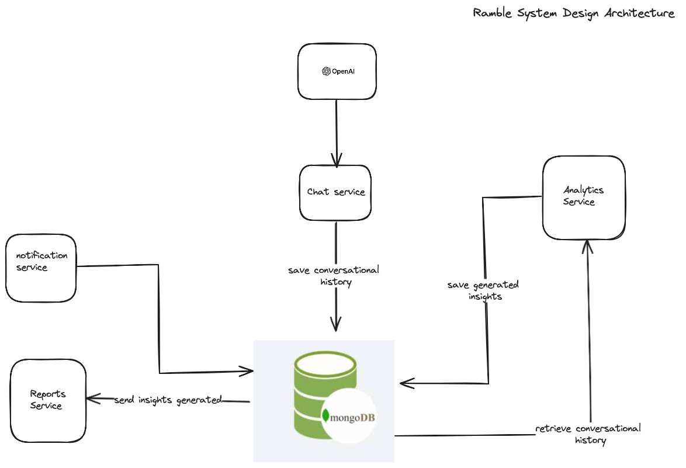

## RAMBLE: AI Journal and Self-Development Conversational Coach

**What is Ramble?**

Ramble is an AI journal and self-development conversational coach. It functions essentially as a friend you can talk to about your day, including your activities, setbacks, feelings, etc. Ramble then analyzes your conversations to provide daily motivation and helpful information to manage your day effectively.

**Functional Requirements**
- The systems should be able to have a conversation wtih the user
- The system should be able to provide user with insights into maximizing their productivity 
- The system should be able to provide users with ways to do time and energy management 
- The system should provide users with motivation to go throguh their day 

**Non-Functional Requirements**
- The system should be highly available 
- The system should be reliable
- The systems analystics should be accurate  

* [To be defined by you]

**System Architecture**

 
Ramble utilizes a microservice architecture consisting of four primary services:

**1. Chat Service**

* Handles the conversational aspect of the project.
* Leverages OpenAI's GPT-4 model as the conversational LLM.
* Employs a meticulously designed system prompt that provides context to the LLM and connects to a message history stored in a non-relational database.

**2. Database Service**

* Manages all data insertion and retrieval from the MongoDB database.
* MongoDB was chosen specifically due to:
    * The unstructured nature of conversational history.
    * Its high reliability and availability, aligning with project requirements. 

**3. Analytics Service**

* Analyzes user interactions with the chat service to extract valuable insights.
* Primarily aims to help users maximize daily productivity by establishing effective personal systems and managing time and energy efficiently.

**4. Reports Service**

* Processes insights generated by the analytics service.
* Categorizes insights into concise yet detailed reports on productivity management, time management, energy management, and general motivation.

**5. Notification Service**

* Analyzes a user's mood from the previous day.
* Provides the user with necessary motivational messages for the day in a quirky and fun manner.

**Benefits of Decoupled Architecture**

The decoupled architecture ensures application functionality even if one of the sub-services is unavailable.
